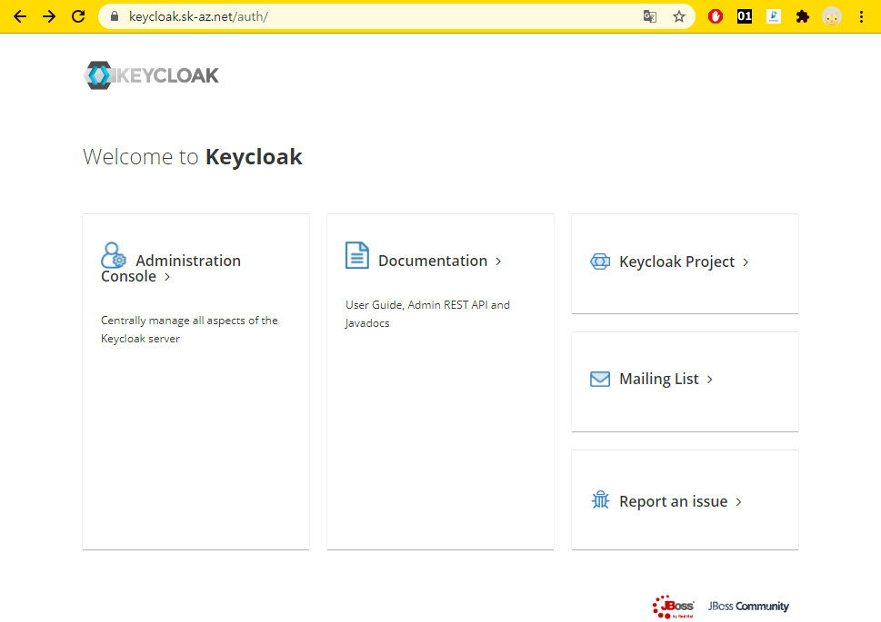
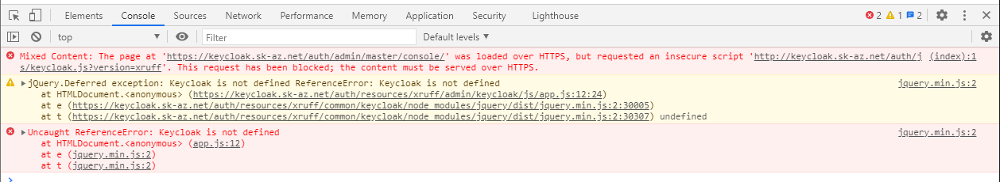

# Azure AKS 에서 keycloak 설치

이 문서를 작성하다 보니 이미 예전에 AKS에서 keycloak을 설치한 적이 있네요.
- https://github.com/anabaral/azure-etude/blob/master/aks-keycloak-install.md
- 당시 설치한 건 APP 버전 기준 11.0.0 인데 2021-06 현재 13.0.1 버전이 최신
- 잊고 있던 문제가 존재하는 걸 확인해서.. 조금 더 조사가 필요할 듯 합니다.
- keycloak 관련해서는 Github 내 다른 리포지토리에서 많이 다루었기에 위 문서는 딱 '다른'점만 불친절하게 설명하고 말았습니다.  
  설치과정 포함해서 다시 처음부터 다루어야 할 듯.


빝나미 사이트에서 확인해 보면 https://bitnami.com/stack/keycloak/helm  
Azure Marketplace 에 keycloak이 있는 것 같습니다.  
다만 둘의 차이가 지원의 차이 같으니 bitnami 것을 우선으로 받아 보겠습니다.


## 헬름 저장소 확인

```
$ helm repo list
$ helm repo add bitnami https://charts.bitnami.com/bitnami   # bitnami가 없으면

$ helm search repo bitnami/keycloak
NAME                    CHART VERSION   APP VERSION     DESCRIPTION
bitnami/keycloak        3.0.4           13.0.1          Keycloak is a high performance Java-based ident...
```

## 시험 설치

그냥 아무런 옵션 없이 설치해 볼게요.
```
$ kubectl create ns sso
$ helm install keycloak bitnami/keycloak --namespace sso 
```

설치 시 나오는 가이드 중에 제일 중요한 것은 임시 비번 관련한 것입니다.
```
# 암호 얻는 방법
echo Username: user
echo Password: $(kubectl get secret --namespace sso keycloak -o jsonpath="{.data.admin-password}" | base64 --decode)
```

아무 옵션 없이 설치할 경우 다음이 확인됩니다:
- 해당 네임스페이스에 `LoadBalancer` 타입의 서비스가 만들어집니다.
  우리는 domain name 기준으로 서비스할 생각이므로 ingress 를 생성하고 거기 연결시켜야겠네요.  
  그 전에 당장 로그인 및 비번 변경 정도는 가능하겠죠.
  ```
  $ kubectl get svc -n sso
  NAME                           TYPE           CLUSTER-IP     EXTERNAL-IP      PORT(S)                      AGE
  keycloak                       LoadBalancer   10.0.13.160    20.194.113.146   80:30357/TCP,443:32027/TCP   114s
  ```
- 기본 DB로 postgresql 이 설치됩니다. 이 정도면 괜찮은 DB 같은데요.
  ```
  $ kubectl get po -n sso
  NAME                    READY   STATUS    RESTARTS   AGE
  keycloak-0              1/1     Running   0          3m2s
  keycloak-postgresql-0   1/1     Running   0          3m2s
  ```
- 이 DB를 위한 PVC도 만들어집니다.
  ```
  $ kubectl get pvc -n sso
  NAME                         STATUS   VOLUME                                     CAPACITY   ACCESS MODES   STORAGECLASS   AGE
  data-keycloak-postgresql-0   Bound    pvc-5da16d1a-fdf7-45dd-9dfb-d1abbc3677fb   8Gi        RWO            default        4m53s
  ```


다시 삭제하고 다시 설치할 건데, 그 전에 수집할 정보가 있습니다.  
예전 설치 경험(https://github.com/anabaral/azure-etude/blob/master/aks-keycloak-install.md) 문서를 보면 다음이 필요함을 알 수 있습니다:
- storageclass를 실행 uid 를 맞추도록 새로 만들어야 함.
- theme 에 해당하는 디렉터리를 찾아서 볼륨을 미리 생성해야 함.
- data, configuration 에 해당하는 디렉터리는 생성하지 않고 보류. (버전 별 특성이 있어 만들던 볼륨이라)

정보를 수집하기 위해 다음을 실행합니다:
```
$ kubectl exec -it -n sso keycloak-0 -- bash
```
알아낸 정보는 다음과 같습니다:
- uid=1001 (그런데 /etc/passwd 에는 없는 사용자임)
- basedir=/opt/bitnami/keycloak/standalone
- themedir=/opt/bitnami/keycloak/themes


설치되었던 걸 다시 삭제합니다.
```
$ helm delete keycloak -n sso
$ kubectl delete pvc data-keycloak-postgresql-0 -n sso
```

StorageClass 생성
```
$ vi keycloak-sc.yaml
allowVolumeExpansion: true
apiVersion: storage.k8s.io/v1
kind: StorageClass
metadata:
  labels:
    kubernetes.io/cluster-service: "true"
  name: azurefile-keycloak               # 이름 바꾸고
parameters:
  skuName: Standard_LRS
provisioner: kubernetes.io/azure-file
reclaimPolicy: Delete
mountOptions:                            # 요게 중요. keycloak 유저에 맞추자.
  - uid=1001
  - gid=1001
volumeBindingMode: Immediate

$ kubectl create -f keycloak-sc.yaml
```

** custom theme 을 사용할 때만 쓰세요.  
themedir 생성
```
$ vi keycloak-pvc.yaml
apiVersion: v1
kind: PersistentVolumeClaim
metadata:
  name: keycloak-storage-theme
  labels:
    app: keycloak
  namespace: sso
spec:
  storageClassName: azurefile-keycloak # 새로만든 걸로
  accessModes:
    - ReadWriteOnce
  resources:
    requests:
      storage: 500Mi

$ kubectl create -f keycloak-pvc.yaml
```

** extraVolumes 와 extraVolumeMounts 는 custom theme 을 사용할 경우에만 고려하세요.
설치용 파일 
```
$ keycloak-values-13.0.1.yaml
service:
  type: ClusterIP
ingress:
  enabled: true
  hostname: keycloak.sk-az.net
  certManager: true
  annotations:
    appgw.ingress.kubernetes.io/ssl-redirect: "true"
extraVolumes: |
  - name: theme
    persistentVolumeClaim:
      claimName: keycloak-storage-theme
extraVolumeMounts: |
  - mountPath: /opt/bitnami/keycloak/themes_temp
    name: theme
```

설치
```
$ helm install keycloak bitnami/keycloak -n sso -f keycloak-values-13.0.1.yaml
```

다 좋은데 https 접근이 안되네. 위의 `ingress.certManager` 설정은 ingress에 고작 한 줄 추가해 줌: `kubernetes.io/tls-acme: "true"`  
작업을 해 줘야겠다.
```
# clusterissuer는 이미 만든거 그대로 사용


# certificate 를 만들자
$ vi keycloak-cert.yaml
apiVersion: cert-manager.io/v1
kind: Certificate
metadata:
  name: sso-prd-tls
  namespace: sso #### namespace별 생성
spec:
  secretName:  sso-prd-tls
  issuerRef:
    name: letsencrypt-prod
    kind: ClusterIssuer
  commonName: keycloak.sk-az.net
  dnsNames:
  - keycloak.sk-az.net


$ kubectl create -f keycloak-cert.yaml
$ kubectl describe certificate -n sso sso-prd-tls
# 'The certificate has been successfully issued' 메시지 확인

$ kubectl get ing -n sso keycloak -o yaml > keycloak-ing.yaml
$ vi keycloak-ing.yaml
apiVersion: extensions/v1beta1
kind: Ingress
metadata:
  annotations:
    appgw.ingress.kubernetes.io/ssl-redirect: "true"  # 이건 설치할 때 
    kubernetes.io/tls-acme: "true"                    # 이건 설치할 때 
    kubernetes.io/ingress.class: nginx                # 추가
    cert-manager.io/issuer: letsencrypt-prod          # 추가
    meta.helm.sh/release-name: keycloak
    meta.helm.sh/release-namespace: sso
  labels:
    app.kubernetes.io/component: keycloak
    app.kubernetes.io/instance: keycloak
    app.kubernetes.io/managed-by: Helm
    app.kubernetes.io/name: keycloak
    helm.sh/chart: keycloak-3.0.4
  name: keycloak
  namespace: sso
spec:
  rules:
  - host: keycloak.sk-az.net
    http:
      paths:
      - backend:
          serviceName: keycloak
          servicePort: http
        path: /
        pathType: ImplementationSpecific
  tls:                                              # 추가
  - hosts:                                          # 추가
    - cloudadaptor.sk-az.net                        # 추가
    secretName: sso-prd-tls                         # 추가


$ kubectl apply -f keycloak-ing.yaml
```

** custom theme 준비
```
$ kubectl exec -it -n sso keycloak-0  -- bash
I have no name!@keycloak-0:/$ cd /opt/bitnami/keycloak/
I have no name!@keycloak-0:/opt/bitnami/keycloak$ ls
...  themes  themes_temp  ...
I have no name!@keycloak-0:/opt/bitnami/keycloak$ cp -a themes/* themes_temp/
I have no name!@keycloak-0:/opt/bitnami/keycloak$ exit
$ kubectl edit sts -n sso keycloak
        volumeMounts:
        - mountPath: /opt/bitnami/keycloak/themes    # themes_temp 를 찾아서 기존의 themes 를 대체하도록 바꿈
          name: theme
$ kubectl get po -n sso
NAME                    READY   STATUS        RESTARTS   AGE
keycloak-0              1/1     Terminating   0          128m   # Statefulset 은 Deployment와 달리 원래 Pod가 다 종료되고 난 뒤에 뜹니다
keycloak-postgresql-0   1/1     Running       0          128m
```

초기화면:  


[Administration Console]을 클릭하면 들어가는데, 의외로 복병이 있음.


이거 어떻게 해결했었지...? ~~대충 생각나는데, 아마 TLS 설정 하기 전에 콘솔에서 Origin인가를 조정해 줘야 했던 것 같음~~  
외부 JS가 아니므로 Origin으로 해결하는 게 아니고.. `${AuthBaseURL}` 에 해당하는 값을 바꿔 줘야 하는데 그게 초기화면 URL인 Frontend URL 입니다.
  
이걸 잘못 입력하면 화면을 못들어가서 새로 설치해야 하는 불상사가 발생합니다...!  
급한대로 다시 바꾸는 방법을 소개하면 다음과 같음:
```
## 2021-06 현재 최신본의 기본DB로 같이 설치되는 postgresql 기준
## keycloak pod에 들어감 
> kubectl exec -it -n sso keycloak-postgresql-0 -- bash
## 여러 정보를 얻음. 특히 postgresql DB 접속 관련 정보
...$ set
## db에 붙음
...$ psql -U bn_keycloak -d bitnami_keycloak
Password for user bn_keycloak:
## database 뭐있나
bitnami_keycloak=> \list
## table들 뭐있나
bitnami_keycloak=> \dt
# 렐름설정에 있음.
update realm_attribute set value = '' where realm_id = 'master' and name = 'frontendUrl';
```
애석하게도 이렇게 바꿔준다고 바로 반영되지 않습니다. Pod 을 죽여 재시작을 해줘야 합니다. (오래 기다려야 해요)
```
> kubectl delete po -n sso keycloak-0
```

또 생각해야 할 것이, 어이없게도 위의 frontend URL 설정과 ingress의 SSL 설정은 짝이 맞아야 하는데 둘 중 하나가 안되면 그것대로 이해할 수 없는 에러가 납니다.  
그러므로 하나 고쳐 보고 '안되네?' 싶어 롤백하는 접근을 사용하면 영원히 못고치죠...


