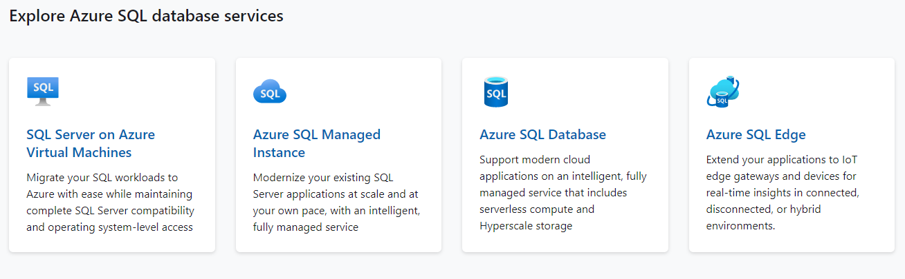
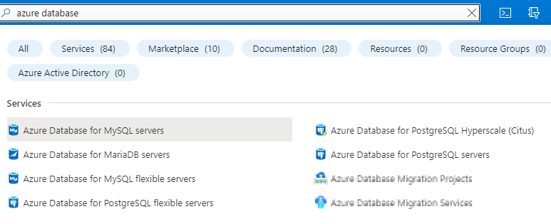

# Azure resource를 start / stop 하는 API 존재여부

## Virtual Machine

있음. (내용은 생략)

## Databases

데이터베이스들은 아무 생각 없이 찾으면 다음이 있는 걸로 나오는데 모두 Microsoft SQL Server 호환 DB들입니다.

가능함을 확인한 데이터베이스들:
- Azure SQL Virtual Machine : 위 그림에서 'SQL Server on Azure Virtual Machines' 로 나오는 것.
  + Virtual Machine 에 SQL Server를 설치하고 쓰는 방식인 듯
  + 즉 같은 이름의 Virtual Machine이 존재하며 Virtual Machine을 껐다켜는 방식으로 제어 가능.
- Azure Database for MySQL : 아래 그림 참조
- Azure Database for MySQL flexible server : 아래 그림 참조 
- Azure Database for MariaDB : 아래 그림 참조
- Azure Database for Postgresql flexible server : 아래 그림 참조

지원안되는 데이터베이스들 (2022년 3월 현재 확인) :
- Azure SQL managed instances : 위 그림에서 'Azure SQL Managed Instance' 로 나오는 것.
- Azure Database for PostgreSQL servers - single server : 아래 그림 참조
- Azure Cosmos DB : NoSQL DB
- SQL databases : 위 그림에서 'Azure SQL Database' 로 나오는 것.

파악되지 않은 데이터베이스
- Azure Database for PostgreSQL Hyperscale : 아래 그림 참조 
- Azure SQL Edge : 위 그림 참조

다음이 우리가 익숙한 (Non-MS) Database들입니다.

