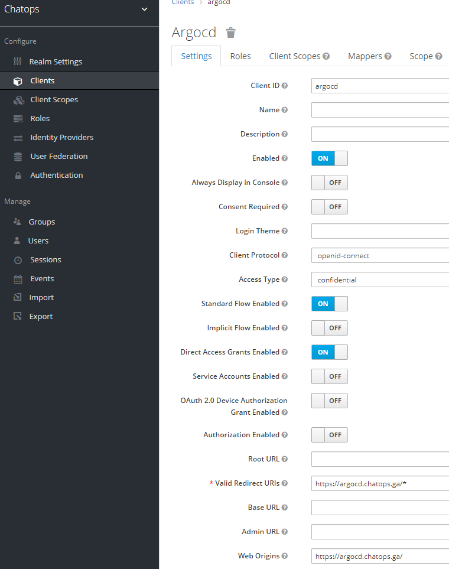
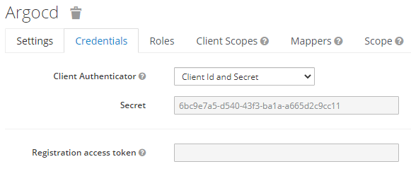

# Keycloak - ArgoCD 연동

ArgoCD 에서 Keycloak 을 통한 로그인을 하도록 설정해보겠습니다.

## Keycloak Side

`ChatOps` 렐름에 클라이언트를 추가합니다.
- Client ID: argocd




이걸 적절히 편집할 건데, 우선 Settings 탭에서 다음을 손봅니다:
- Access Type ID: confidential
- Valid Redirect URIs: `https://argocd.chatops.ga/*`
- Web Origins: `https://argocd.chatops.ga/*`
- 저장.




Credentials 탭에서 Client Secret 값을 갈무리해 둡니다.


## ArgoCD Side

Config Map을 손봐야 합니다:
```
$ kubectl get cm -n cicd argocd-cm -o yaml  > argocd-cm-4keycloak.yaml
$ vi argocd-cm-4keycloak.yaml
apiVersion: v1
data:
  application.instanceLabelKey: ...   # 이미 존재하는 값
  url: https://argocd.chatops.ga      # 이미 존재하는 값. 틀리지 않은지만 확인
  oidc.config: |                                              # 여기부터 입력할 값
    name: keycloak
    issuer: https://keycloak.chatops.ga/auth/realms/chatops
    clientID: argocd
    clientSecret: aaaaaaaa-bbbb-cccc-dddd-eeeeeeeeeeee
    requestedScopes: ["openid", "profile", "email"] # 여기까지 입력
kind: ConfigMap
...
```
이 때 requestedScopes 는 `openid` 외에는 위 렐름의 `Client Scope` 에 등록된 것만 넣어야 합니다.
이를테면 `groups` 같은 걸 추가하고 싶다면 `Client Scope` 에 먼저 추가해 두어야 합니다.

ArgoCD 는 ConfigMap의 변경을 스스로 인지하여 반영하기 때문에 위의 변경이 완료되면 잠시 후 로그인이 가능해집니다.


