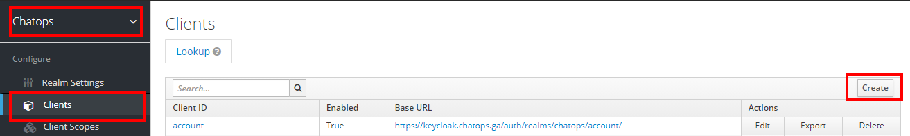
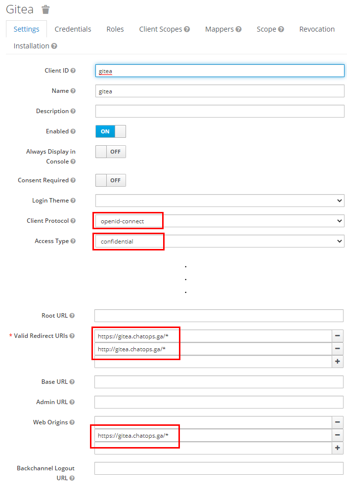
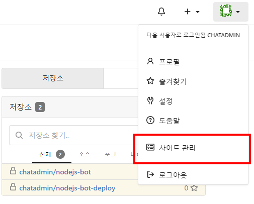
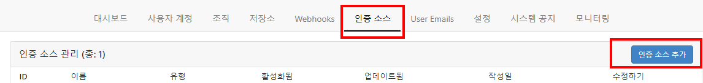
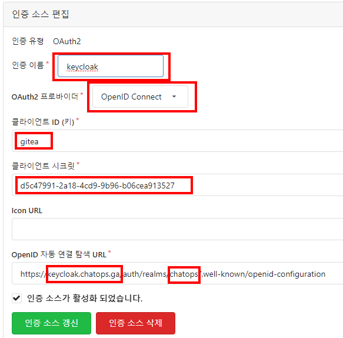

# Keycloak - Gitea 연동

양쪽에서 설정합니다.

## Keycloak Side

  
- 맞는 렐름을 선택 후 
- 클라이언트 블레이드에서 [Create] 버튼 클릭

  
- Access Type: confidential
- Valid Redirect URL: `https://{domain}/*` 과 `http://{domain}/*` 을 입력. 
  * `http://{domain}/*` 은 입력 안해도 되어야 하는데 어딘가 값이 잘못 되었는지 계속 `http://` 값이 쓰이고 있어 부득이하게 선택
- Web Origins: `https://{domain}/*` 입력. 이건 불필요할 수도 있지만 안전을 위해 입력함.

## Gitea Side

  
관리자 권한으로 로그인해서 사이트 관리 메뉴로 들어감

  
인증소스 탭에서 [인증소스 추가] 버튼

  
- client id : keycloak 에서 정한 client id를 입력
- client secret : keycloak client의 credential 메뉴에서 값을 취해 입력 
- OpenID connect auto discovery URL : domain name 과 realm 을 규칙에 맞게 채움

