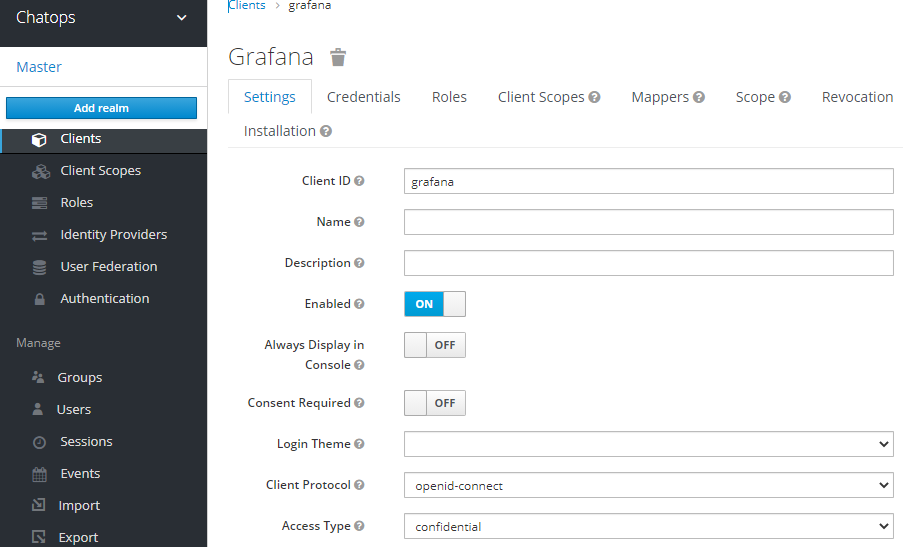
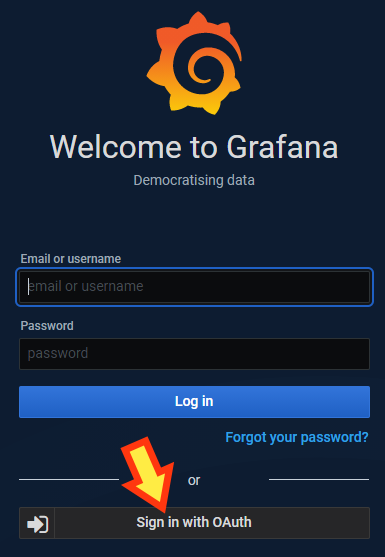

# Grafana 연동

## Keycloak 설정

keycloak의 해당 렐름에 클라이언트를 추가하는데

신경 쓸 것은 오직 두 가지 뿐입니다.
- 이름 : 여기선 grafana
- 접근타입: confidential

저장하면 끝.

(좀더 상세히 들어가면 유저라든지 그룹이라든지 추가해야 하는데 다른 걸 할 때 이미 추가했다 치죠)


## Grafana 설정

※ helm 설치옵션에 grafana.ini 파일을 configMap으로 로딩하도록 만들었으면 조금 다른(어쩌면 쉬운) 접근법을 쓸 수 있습니다

설치된 상태에서 시작합니다. 일단 관련 정보를 수집한 후 grafana.ini 파일을 얻습니다.
```
# pod name 식별
$ kubectl get po -n monitoring | grep grafana              
grafana-db6c94467-stkd9      1/1   Running    0    3h6m

# 파일 위치 식별
$ kubectl exec -n monitoring  grafana-db6c94467-stkd9 -- find / -name "grafana.ini" 2>/dev/null  
/opt/bitnami/grafana/conf/grafana.ini

# 파일 저장
$ kubectl exec -n monitoring  grafana-db6c94467-stkd9 -- cat /opt/bitnami/grafana/conf/grafana.ini > g.ini  
```


이 g.ini 파일을 수정합니다
```
$ vi g.ini
...
root_url = https://grafana.chatops.ga
...
[auth.generic.oauth]  # 바뀌는 부분 위주로 나열하겠음
    enabled = true
    name = OAuth
    allow_sign_up = true
    client_id = grafana
    client_secret = 8d52c66c-xxxx-yyyy-zzzz-36dd1203e666
    scopes = openid email profile
    auth_url = https://keycloak.chatops.ga/auth/realms/chatops/protocol/openid-connect/auth
    token_url = https://keycloak.chatops.ga/auth/realms/chatops/protocol/openid-connect/token
    api_url = https://keycloak.chatops.ga/auth/realms/chatops/protocol/openid-connect/userinfo
```
위에서 `scopes` 부분은 어떻게 사용하느냐에 따라 입력값이 다른 것 같은데 잘 몰라서 저 정도만 썼습니다.

수정한 파일을 이용해 configmap을 생성합니다.
```
$ vi grafana-ini-cm.yaml
apiVersion: v1
data:
  grafana.ini: |
    <위 g.ini 파일 내용을 Indent를 부여해 여기 넣음>
kind: ConfigMap
metadata:
  annotations:
    meta.helm.sh/release-name: grafana
    meta.helm.sh/release-namespace: monitoring
  labels:
    app.kubernetes.io/component: grafana
    app.kubernetes.io/instance: grafana
    app.kubernetes.io/managed-by: Helm
    app.kubernetes.io/name: grafana
    helm.sh/chart: grafana-5.2.17
  name: grafana-ini
  namespace: monitoring
```
labels 등의 정보는 기존 설정된 ConfigMap 정보 등에서 퍼오면 됩니다.

이제 ConfigMap을 생성하고
```
$ kubectl create -f grafana-ini-cm.yaml
```

이것을 Grafana Deployment 가 인식하도록 적용합니다.
```
$ kubectl edit deploy -n monitoring grafana
...
        # 컨테이너 설정에서
        volumeMounts:
        ...
        - mountPath: /opt/bitnami/grafana/conf/grafana.ini
          name: grafana-ini
          subPath: grafana.ini
...
      # 공용 설정에서
      volumes:
      ...
      - configMap:
          defaultMode: 420
          name: grafana-ini
        name: grafana-ini
```

grafana가 다시 시작하고 로그인 화면으로 가 보면 다음과 같이 OAuth 를 사용한 로그인이 가능해집니다.



