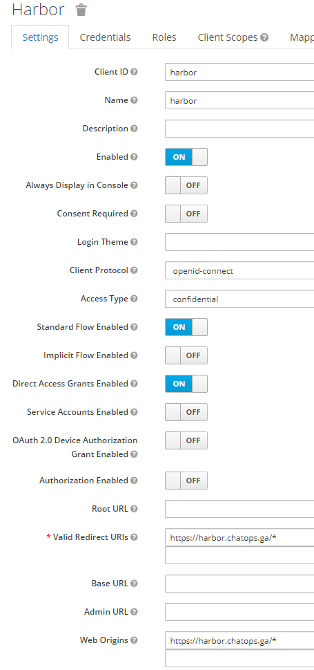
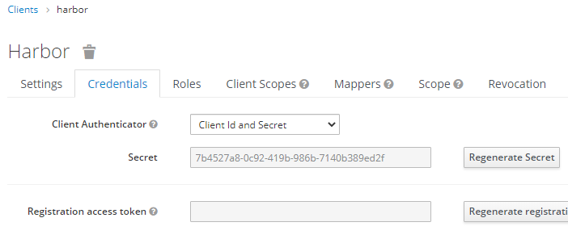
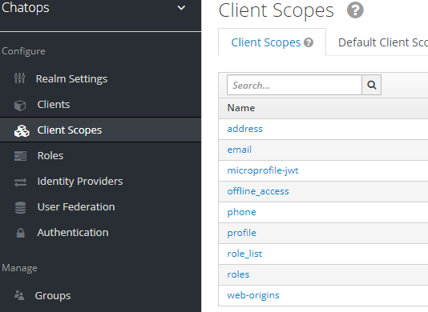
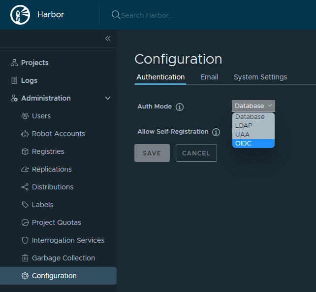
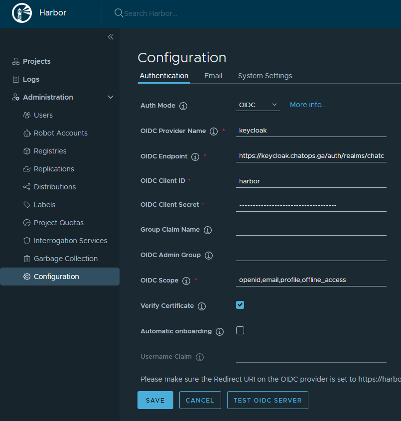

# Harbor와 Keycloak 연동

## Keycloak Side

1. 관리자 권한 로그인
2. ChatOps 렐름의 Client 블레이드 선택, Client 추가
   - client id : harbor
   - client protocol: openid-connect (아마 기본값일 것)
   - access type: confidential
   - valid redirect uris: https://harbor.chatops.ga/*
   - web origins: https://harbor.chatops.ga/*
   - 참조: 
3. 같은 블레이드에서 Credentials 탭 선택
   - Secret 값 갈무리 (아래 값을 캡처하고 다시 생성했으니 안심하세요)
   - 
4. Client Scopes 블레이드 선택. 여기는 참조만 합니다. (대략 어느 정보들을 공유할 것인가의 목록이라고 보여집니다)
   

## Harbor Side

1. 관리자 권한 로그인
2. Administration / Configuration 블레이드 선택
   - Auth Mode: OIDC  
     
   - OIDC Provider Name: keycloak
   - OIDC Endpoint: https://keycloak.chatops.ga/auth/realms/chatops
   - OIDC Client ID: harbor
   - OIDC Client Secret: 위에 갈무리해 둔 Secret 값
   - OIDC Scope: openid,email,profile,offline_access  (위에서의 Client Scopes 값들이며 openid, offline_access 둘이 필수라고 써 있음)
   - [TEST OIDC SERVER] 및 [SAVE]
   - 
3. 로그아웃 하면 [OIDC LOGIN] 버튼이 보입니다.

