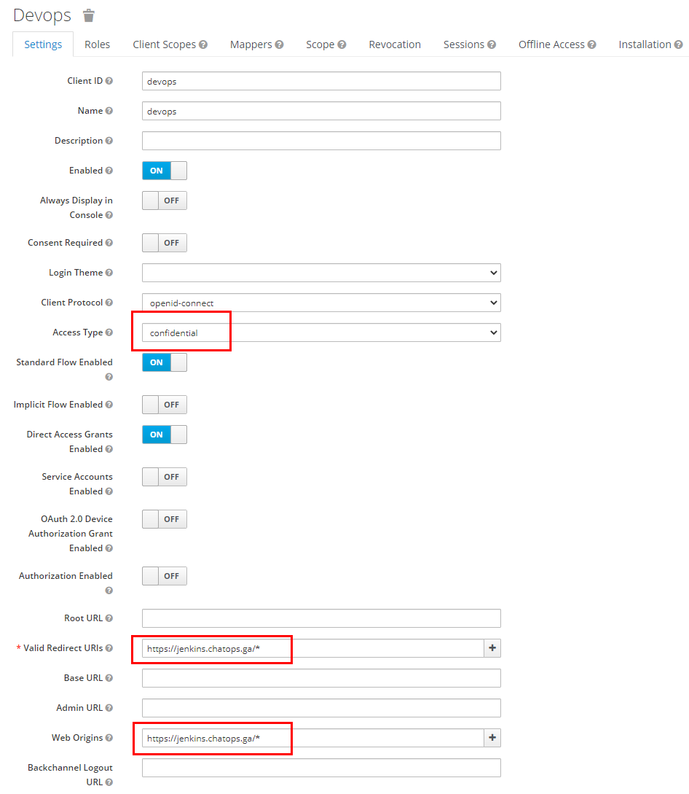
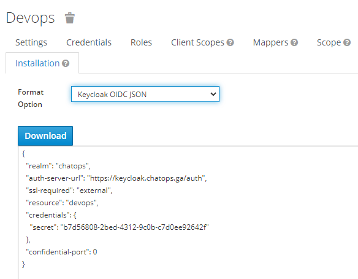
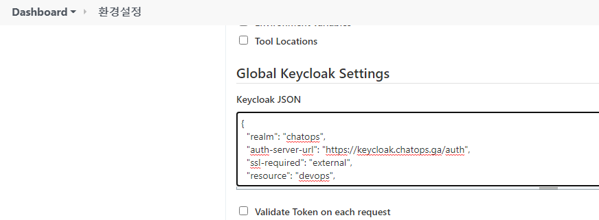
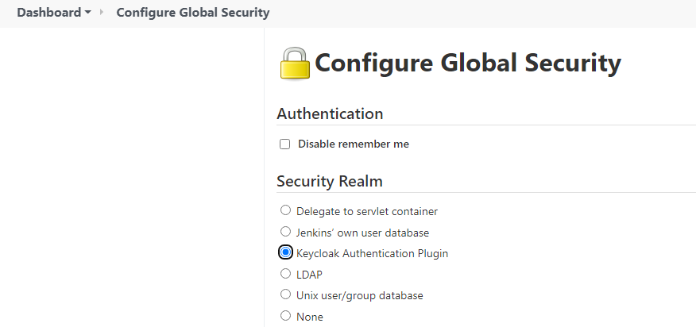

# Keycloak - Jenkins 연동

Jenkins 에서 Keycloak 을 통한 로그인을 하도록 설정해보겠습니다.

## Keycloak Side

이 글을 처음 작성하는 현재 `ChatOps` 렐름에 `devops` 클라이언트가 이미 생성되어 있습니다. 
이걸 적절히 편집할 건데, 우선 Settings 탭에서 다음을 손봅니다:
- Access Type ID: confidential
- Valid Redirect URIs: `https://jenkins.chatops.ga/*`
- Web Origins: `https://jenkins.chatops.ga/*`
- 저장.

동일 클라이언트에서 Installation 탭이 있습니다. 여기서 
- Format Option: Keycloak OIDC JSON 을 선택하면
- 나오는 JSON 텍스트를 갈무리 해 둡니다.

## Jenkins Side

- Jenkins 관리 / 시스템 설정 에 들어가서 Global Keycloak Settings 카테고리로 간 후
  * Keycloak JSON 란을 위에 갈무리한 텍스트로 채웁니다.
  * 저장.

- Jenkins 관리 / Configure Global Security 로 들어가서
  * Security Realm 의 선택항목을 `Keycloak Authentication Plugin` 으로 선택합니다.
  * 위의 것에 문제가 있을 경우 [저장]한 후 로그인을 못할 수 있으니 꼼꼼히 체크하세요.
  * 저장.

로그아웃 하면 다시 로그인 창 뜰 때 Keycloak 것이 뜰 겁니다.

